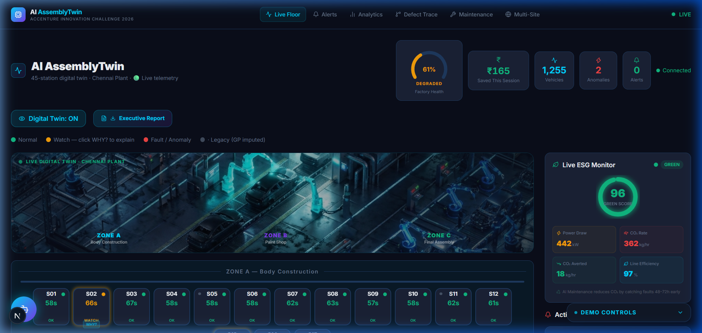
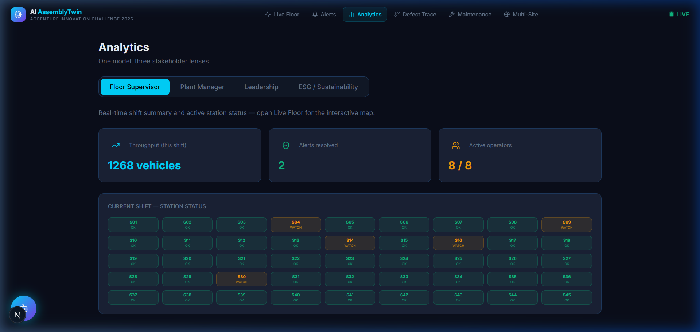
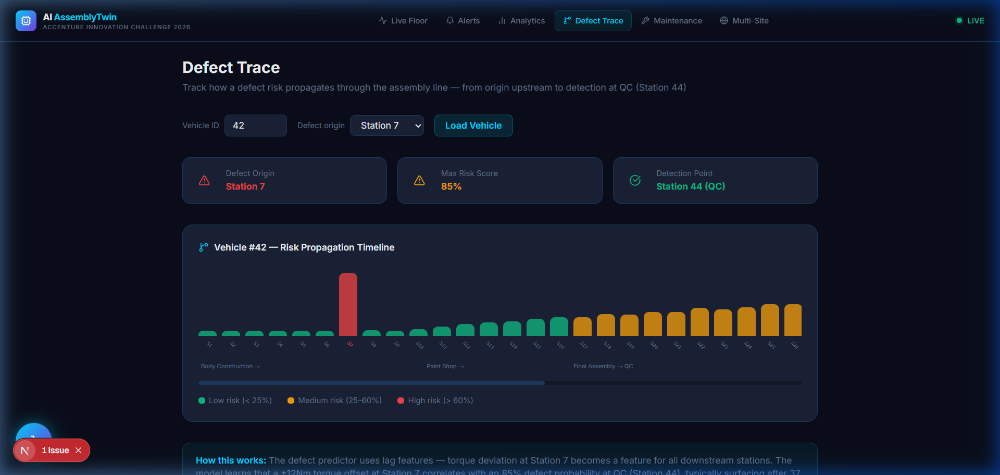
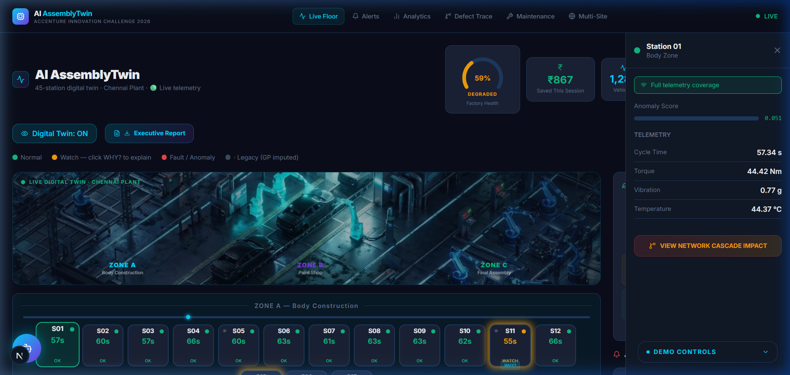

# AI AssemblyTwin

> Live digital twin and predictive analytics platform for a 45-station vehicle assembly line.  
> Built for the **Accenture Innovation Challenge 2026** — Problem Statement: DigitalTwin.ai

[](https://frontend-r5vs3wevi-jayanths-projects-c674d092.vercel.app)
[](https://nextjs.org/)
[](https://fastapi.tiangolo.com/)
[](https://www.typescriptlang.org/)

---

## 🌐 Live Demo

**[https://frontend-r5vs3wevi-jayanths-projects-c674d092.vercel.app](https://frontend-r5vs3wevi-jayanths-projects-c674d092.vercel.app)**
*(Or locally: **[http://localhost:3000](http://localhost:3000)**)*

> The frontend is deployed on Vercel. The WebSocket simulation engine runs on a persistent backend. For the full live telemetry experience, run the backend locally (see [Local Setup](#local-setup--execution)) and update the API base URL.

---

## 📸 Screenshots

### Live Floor — 45-Station Digital Twin Map


### Analytics — Multi-Stakeholder Dashboards


### Defect Trace — Upstream Root Cause Propagation


### Station Drawer — Real-time Telemetry & GP Imputation


---

## Project Overview

AI AssemblyTwin simulates a 45-station vehicle assembly line using SimPy discrete-event simulation and streams telemetry in real time to a Next.js web application. Machine learning models run against the live telemetry stream to detect cycle-time anomalies, forecast bottlenecks before line stoppage occurs, impute missing sensor metrics on legacy stations, and trace quality defects back to their upstream origins.

The application includes five dedicated pages for different operational roles:
- **Live Floor (`/`)**: Interactive 45-station map, real-time KPI metrics, active alerts, and virtual intervention simulator.
- **Analytics (`/analytics`)**: Multi-stakeholder dashboards covering shift throughput, plant manager maintenance recommendations, leadership ROI calculator, and ESG metrics.
- **Defect Trace (`/defect-trace`)**: Upstream root-cause analysis showing how parameter variations propagate downstream to QC stations.
- **Predictive Maintenance (`/maintenance`)**: Maintenance calendar and priority schedule based on model risk scores.
- **Multi-Site (`/multisite`)**: Multi-factory overview dashboard comparing performance across different manufacturing sites.

---

## Architecture & System Design

```
                               ┌────────────────────────────────────────┐
                               │       SimPy Discrete-Event Engine      │
                               │   (45 Stations, Simulated Telemetry)   │
                               └───────────────────┬────────────────────┘
                                                   │ Real-time Events
                                                   ▼
 ┌─────────────────────────────────────────────────────────────────────────────────────────────────┐
 │                                       FastAPI Backend                                           │
 │                                                                                                 │
 │  ┌───────────────────────┐   ┌────────────────────────┐   ┌──────────────────────────────────┐  │
 │  │ Gaussian Process (GPR) │   │ Isolation Forest       │   │  NumPy LSTM & Random Forest      │  │
 │  │ Sensor Imputation      │   │ Anomaly Detection      │   │  Bottleneck & Defect Prediction  │  │
 │  └───────────────────────┘   └────────────────────────┘   └──────────────────────────────────┘  │
 └─────────────────────────────────────────┬───────────────────────────────────────────────────────┘
                                           │ WebSockets (/ws/live) & REST API
                                           ▼
 ┌─────────────────────────────────────────────────────────────────────────────────────────────────┐
 │                                Next.js Frontend Dashboard                                       │
 │                                                                                                 │
 │  ┌───────────────────────┐   ┌────────────────────────┐   ┌──────────────────────────────────┐  │
 │  │  Live Floor Map UI    │   │   Analytics Dashboard  │   │   Upstream Defect Trace Graph    │  │
 │  └───────────────────────┘   └────────────────────────┘   └──────────────────────────────────┘  │
 └─────────────────────────────────────────────────────────────────────────────────────────────────┘
```

### Machine Learning Models

1. **Gaussian Process Sensor Imputation (GPR)**
   - Imputes missing torque, vibration, and temperature metrics for legacy stations without physical sensors using surrounding telemetry.
   - Provides explicit confidence intervals (σ uncertainty bounds) displayed in the UI as "GP Est." amber badges.

2. **Unsupervised Anomaly Detection (Isolation Forest)**
   - Evaluates rolling 10-cycle telemetry buffers across all 45 stations to flag cycle-time drift and vibration anomalies.

3. **Temporal Bottleneck Prediction (NumPy LSTM)**
   - Evaluates multi-station cycle-time trends over time to forecast impending bottleneck formation 15–30 minutes before blockage.
   - Uses exported model weights executed via pure NumPy matrix operations to run lightweight inference without heavy GPU runtime overhead.

4. **Multi-Causal Defect Trace (Random Forest)**
   - Analyzes station feature correlations to identify upstream root causes (e.g., Station 7 torque variation) that result in Station 44 quality failures.

---

## Model Artifacts

Pre-trained model artifacts are stored in `backend/models/artifacts/` (~67 MB total):

| Artifact | File Size | Description |
|---|---|---|
| `anomaly_models.pkl` | ~43.25 MB | Trained Isolation Forest models |
| `sensor_imputer.pkl` | ~15.71 MB | Trained Gaussian Process scalers & estimators |
| `defect_predictor.pkl` | ~7.15 MB | Trained Random Forest defect classifier |
| `bottleneck_lstm_weights.npz` | ~0.91 MB | Exported NumPy LSTM weights for lightweight inference |
| `anomaly_scalers.pkl` | ~0.02 MB | Feature scaling parameters |
| `bottleneck_scaler.pkl` | < 0.01 MB | Sequence scaling parameters |

---

## Local Setup & Execution

### Prerequisites
- **Python**: 3.10+ (3.11 recommended)
- **Node.js**: 18+ (20+ recommended)

### 1. Backend Setup

```bash
cd backend
python -m venv venv

# On Windows:
venv\Scripts\activate
# On Linux/macOS:
source venv/bin/activate

pip install -r requirements.txt
python -m uvicorn main:app --host 127.0.0.1 --port 8000
```
The FastAPI server will start at `http://127.0.0.1:8000` and stream live simulation events via WebSockets.

### 2. Frontend Setup

In a second terminal:

```bash
cd frontend
npm install
npm run dev -- -p 3000
```
Open **[http://localhost:3000](http://localhost:3000)** in your browser.

---

## Demo Instructions

Use the **Demo Controls** panel at the bottom right of the Live Floor page to test scenarios:

### 1. Chaos Mode (Multi-Station Fault Injection)
1. Click **Inject Chaos** — this simultaneously faults 8+ stations across all three zones.
2. Watch the assembly floor map turn RED across every zone in real time.
3. Active alerts populate in the Alerts panel with severity scoring.
4. Click **Resolve** on any alert to run the Intervention Simulator and calculate ROI.

### 2. Bottleneck & Intervention Flow
1. Click **Inject Bottleneck (Station 12)**.
2. Watch Station 12's cycle time degrade from ~62s to >90s over 15–30 seconds.
3. An active **Bottleneck Alert** card will populate in the Active Alerts panel.
4. Click **Simulate →** on the alert card to open the Intervention Simulator.
5. Test any of the 3 candidate interventions:
   - **Add 1 Technician** (+73% recovery)
   - **Reduce Feed Rate 15%** (+55% recovery)
   - **Pause Upstream Buffer** (+100% recovery)
6. Approve the intervention. Station 12 will recover to normal baseline (~59s/OK).

### 3. Defect Origin & Trace Flow
1. Click **Inject Defect (Station 7)**.
2. Navigate to the **Defect Trace** page (`/defect-trace`).
3. Select Station 7 as the defect origin and load the vehicle profile.
4. Review the risk propagation timeline showing how Station 7 torque offset propagates to Station 44 (QC).

### 4. Simulation Reset
1. Click **Reset Simulation**.
2. Vehicles Today resets to 0, active alerts clear, and all 45 stations return to `IDLE / —`.

---

## Deployment & Execution Notes

- **Persistent WebSockets & Simulation Engine**: The FastAPI backend runs a continuous SimPy simulation thread and streams events over WebSockets (`/ws/live`). Deployments require a hosting environment that supports long-running Python background processes and persistent WebSockets rather than short-lived stateless functions.
- **Lightweight LSTM Inference**: The bottleneck prediction model weights were serialized to NumPy (`bottleneck_lstm_weights.npz`) to allow zero-overhead inference without requiring PyTorch at runtime, reducing memory requirements for low-memory container tiers.

---

## Project Structure

```
DigitalTwin.ai/
├── docs/
│   └── screenshots/             # UI screenshots for README
├── PROPOSAL.md                  # Project proposal document
├── README.md                    # System documentation
├── backend/
│   ├── main.py                  # FastAPI server, WebSocket handlers & API routes
│   ├── requirements.txt         # Backend Python dependencies
│   ├── data/                    # Data generation & training scripts
│   ├── models/
│   │   ├── anomaly_detector.py  # Isolation Forest implementation
│   │   ├── bottleneck_predictor.py # NumPy LSTM prediction engine
│   │   ├── defect_predictor.py  # Random Forest defect classifier
│   │   ├── sensor_imputer.py    # Gaussian Process Regression implementation
│   │   └── artifacts/           # Trained ML model weights (~67 MB)
│   └── simulator/
│       └── assembly_line.py     # SimPy 45-station discrete-event simulation engine
└── frontend/
    ├── package.json             # Next.js frontend dependencies
    ├── src/
    │   ├── app/                 # Next.js App Router pages
    │   ├── components/          # React components
    │   ├── lib/                 # Utilities & WebSocket hook
    │   └── types/               # TypeScript type definitions
```
